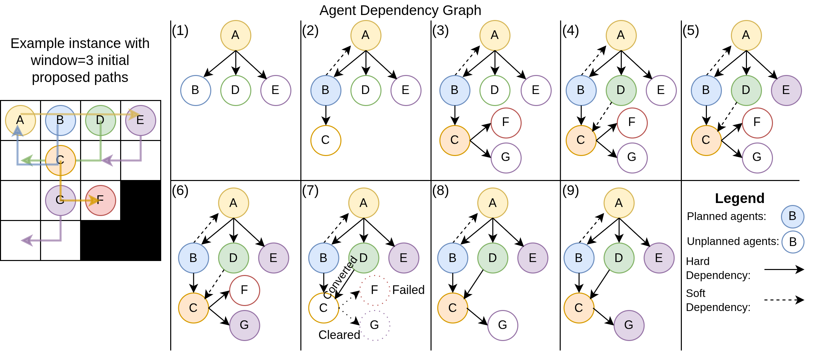
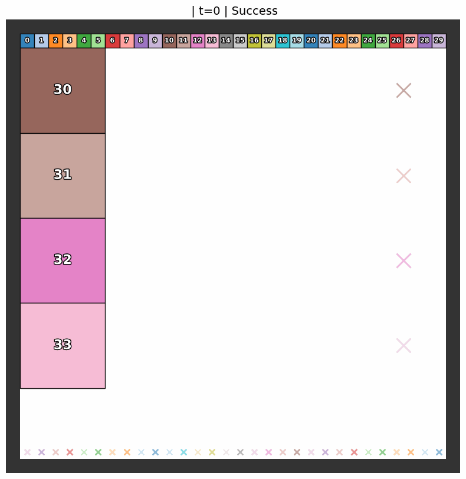

## **Introduction**

We propose Multi-Dependency PIBT (MD-PIBT), published in IROS 2026. MD-PIBT generalizes PIBT [[1]](#references) and EPIBT [[2]](#references) by allowing each agent to bump into multiple agents while planning a multi-step windowed path, using the concept of an Agent Dependency Graph.

## **Agent Dependency Graph**

<figure>
  
  <figcaption><b>Figure 1:</b> Agent Dependency Graph.</figcaption>
</figure>

MD-PIBT builds and searches over an Agent Dependency Graph. Left shows a scenario for planning with a window size of 3, with initial path preferences drawn. Assume all agents' safe paths are waiting at their current location.

(1) Let MD-PIBT start planning with A. A's path conflicts with B, D, and E's safe path, causing A to have hard dependencies on them. Thus, B, D, E need to be planned next. Given multiple agents, we plan in alphabetical order.

(2) When B plans, B's path collides with C and A's safe path. Since A is already planned, we record a soft dependency between B and A.

(3-6) This logic continues until planning F.

(7) F fails to find a collision-free path. When this occurs, F requires a parent (in this case C) to replan. The replan request unplans C which includes removing downstream dependencies and converting soft dependencies to C to hard dependencies.

(8) Suppose that C replans by moving down, which does not intersect with F's safe path. Then F is not included in the AgDG. (9) After planning all agents in the AgDG, we can move on to plan other agents not in the AgDG (not depicted).

## **Demo**

Our experiments show that MD-PIBT significantly outperforms EPIBT [[2]](#references) when coordinating agents of heterogeneous sizes. The comparison below shows both methods on the same scenario.

<figure>
<div class="image-row">
  <figure>
    
    <figcaption>EPIBT</figcaption>
  </figure>
  <figure>
    
    <figcaption>MD-PIBT</figcaption>
  </figure>
</div>
<figcaption><b>Figure 2:</b> EPIBT and MD-PIBT on a heterogeneous-agent scenario.</figcaption>
</figure>

## **Cite**

```bibtex
@inproceedings{Jiang2026md-pibt,
  author    = {Zixiang Jiang and Yulun Zhang and Rishi Veerapaneni and Jiaoyang Li},
  title     = {Planning over MAPF Agent Dependencies via Multi-Dependency PIBT},
  booktitle = {Proceedings of the IEEE/RSJ International Conference on Intelligent Robots and Systems (IROS)},
  pages     = {},
  year      = {2026}
}
```

This software is released under the [MIT License](https://github.com/lunjohnzhang/MD-PIBT/blob/master/LICENSE.txt).

## **References**

**[1]** Keisuke Okumura, Manao Machida, Yasumasa Tamura, and Xavier Défago. “Priority Inheritance with Backtracking for Iterative Multi-agent Path Finding.” *Artificial Intelligence*, 2022.

**[2]** Egor Yukhnevich and Anton Andreychuk. “Enhancing PIBT via Multi-Action Operations.” *Proceedings of the AAAI Conference on Artificial Intelligence*, 2025.
