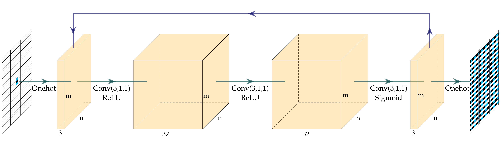
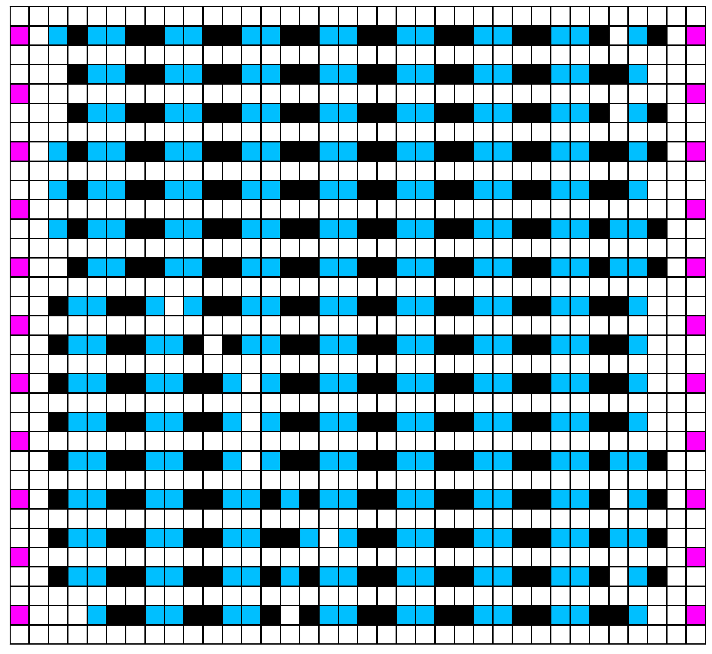
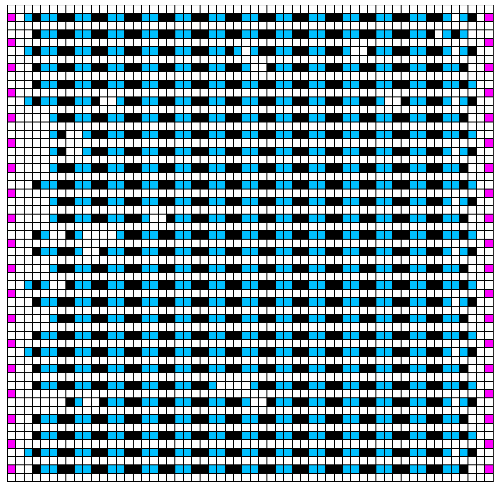
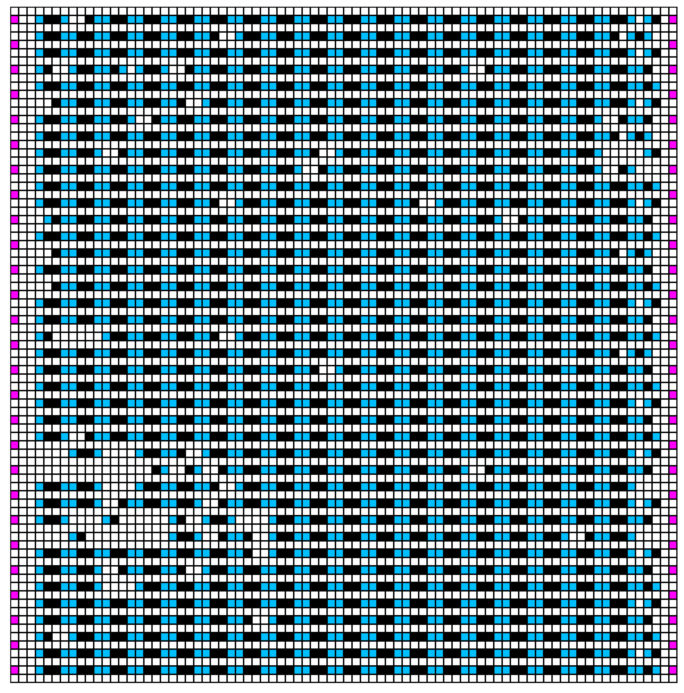
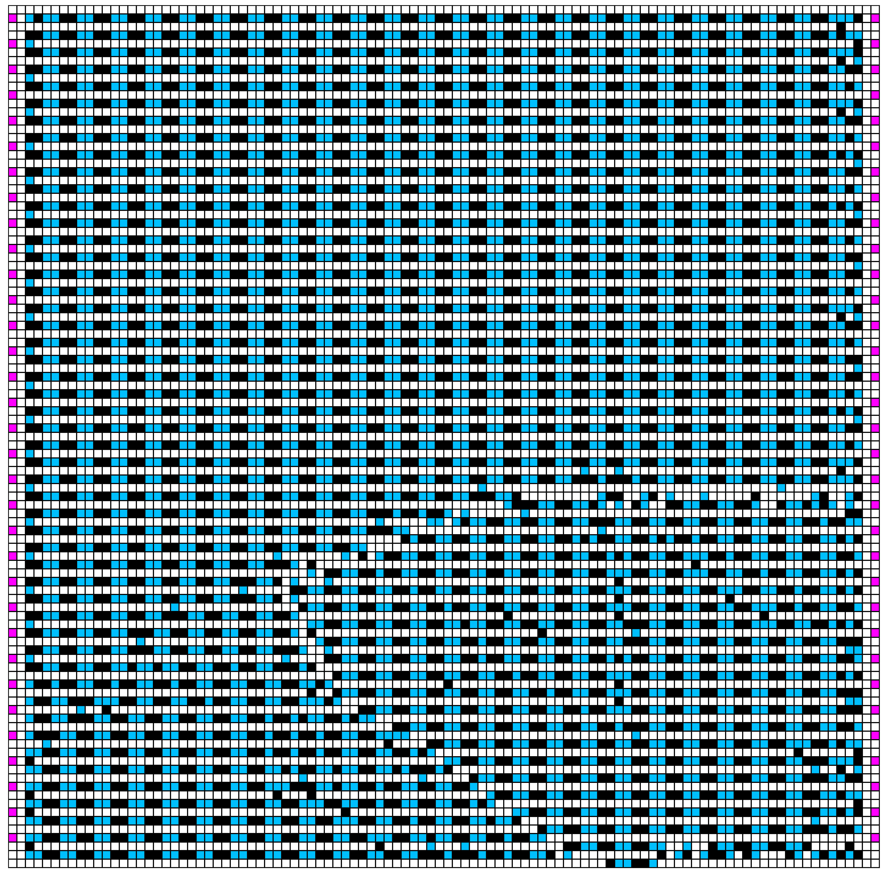
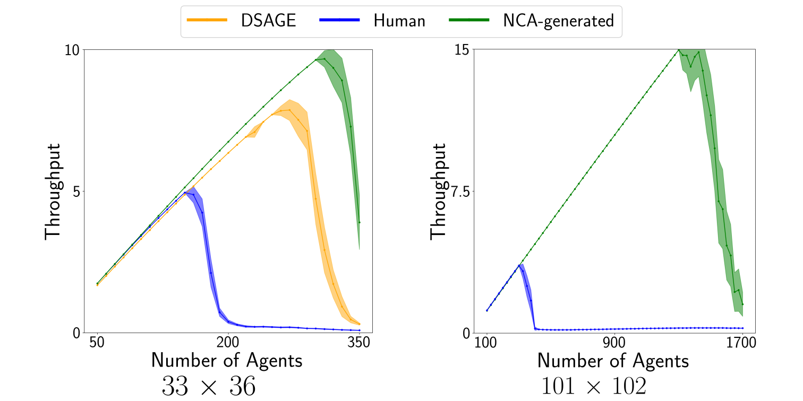
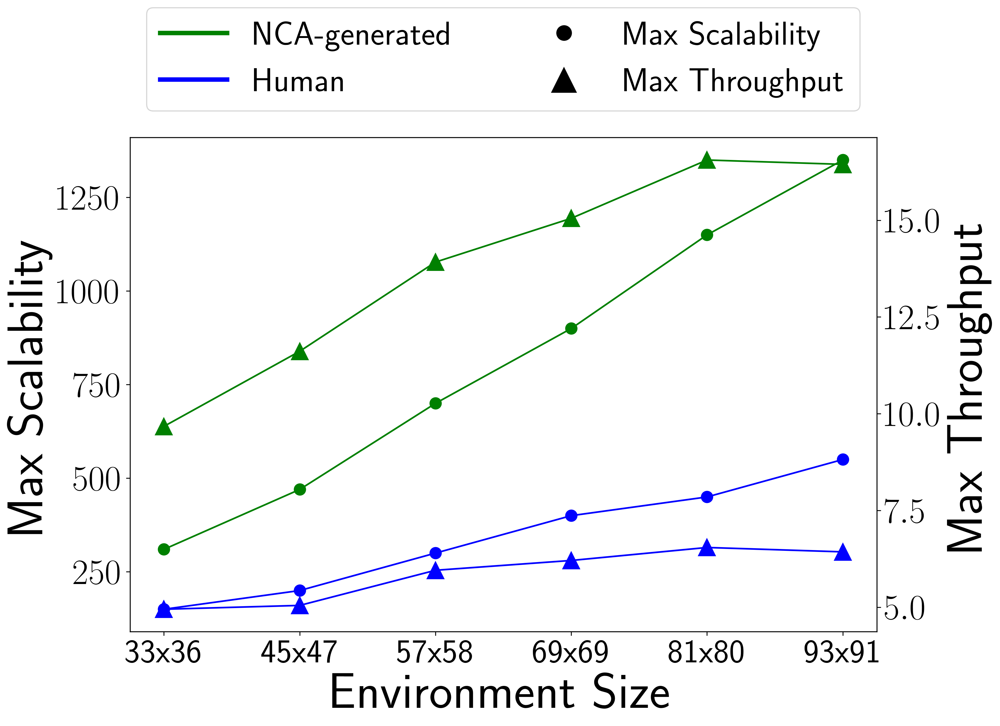

## **Introduction**

Our previous work [[1](/publication/zhang2023layout_opt)] formulates the environment optimization problem as a Quality Diversity (QD) optimization problem and optimizes the environments by searching for combination of tiles. The optimized environments have much higher throughput and are more scalable than human-designed ones. However, with this method, the search space of the QD algorithm grows exponentially with the size of the environment.

Therefore, instead of optimizing the environments directly, this paper proposes to optimize Neural Cellular Automata (NCA) environment generators via QD algorithms. We show that NCA-generated environments maintain consistent, regularized patterns regardless of environment size, significantly enhancing the scalability of multi-robot systems.

<!--  -->

<!-- 
*image_caption* -->

## **Approach Overview**

We extend previous works [[1](/publication/zhang2023layout_opt),[2](https://arxiv.org/abs/2109.05489)] to use CMA-MAE [[3](https://arxiv.org/abs/2205.10752)] to search for a diverse collection of NCA generators with the objective and diversity measures computed from an agent-based simulator that runs domain-specific simulations in generated environments. Figure 1 provides an overview of our method. We start by sampling a batch of $b$ parameter vectors $\boldsymbol{\theta}$ from a multivariate Gaussian distribution, which form $b$ NCA generators. Each NCA generator then generates one environment from a fixed initial environment, resulting in $b$ environments. Figure 2 shows the architecture of the NCA generator.

We then repair the environments using a Mixed Integer Linear Programming (MILP) solver to enforce domain-specific constraints. After getting the repaired environments, we evaluate each of them by running an agent-based simulator for $N_e$ times, each with $T$ timesteps, and compute the average objective and measures. We add the evaluated environments and their corresponding NCA generators to both the optimization archive and the result archive. Finally, we update the parameters of the multivariate Gaussian distribution (i.e., $\mu$ and $\Sigma$) and sample a new batch of parameter vectors, starting a new iteration.
<!-- We run CMA-MAE iteratively with batch size $b$, until the total number of evaluations reaches $N_{eval}$. -->

<figure>
    
    <figcaption><b>Figure 1:</b> Overview of our method. </figcaption>
</figure>

<figure>
    
    <figcaption><b>Figure 2:</b> NCA generator architecture. It is a convolutional neural network (CNN) with 3 convolutional layers of kernel size 3 × 3 followed by ReLU or sigmoid activations. 
    </figcaption>
</figure>

## **Results**

### NCA-generated Environments

Figure 3 shows the NCA-generated environments of different sizes, showing that the trained NCA generators can generate environments of different sizes with consistent regularized patterns. Figure 4 shows an example NCA generation process of 200 iterations.

<figure>

  <figure>
    
    <figcaption>33 $\times$ 36</figcaption>
  </figure>
  <figure>
    
    <figcaption>57 $\times$ 58</figcaption>
  </figure>

  <figure>
    
    <figcaption>81 $\times$ 80</figcaption>
  </figure>
  <figure>
    
    <figcaption>101 $\times$ 102</figcaption>
  </figure>

<figcaption><b>Figure 3:</b> NCA-generated environments of different sizes. </figcaption>
</figure>

<figure>
    <video playsinline autoplay loop muted width=60%>
        <source src="videos/nca_process.mp4" type="video/mp4">
        Your browser does not support the video tag.
    </video>
    <figcaption><b>Figure 4:</b> Example NCA generation process for environment of size 101 $\times$ 102. </figcaption>
</figure>

### Scalability

We then analyze the scalability of the environments by running simulations with varying numbers of agents and show the throughput. We compare our NCA-generated environments with those optimized by DSAGE [[1](/publication/zhang2023layout_opt)], the state-of-the-art environment optimization algorithm, and human-designed ones. Figure 5 shows the result. Our NCA-generated environments have higher throughput than the baseline environments with an increasingly larger gap with more agents.

<figure>
    
    <figcaption><b>Figure 5:</b> Throughput with an increasing number of agents in environments of size 33 $\times$ 36 and 101 $\times$ 102.
    </figcaption>
</figure>

We further analyze the scalability of the NCA-generated environments in other sizes. Figure 6 shows the result. The y-axis illustrates two metrics: maximum mean throughput over 50 simulations (right) and the maximum scalability, defined as the agent count at this maximum (left).

<figure>
    
    <figcaption><b>Figure 6:</b> Scalability of NCA-generated environments.
    </figcaption>
</figure>

### Scaling Single-Agent RL Policy

We also train NCA generators for a single-agent maze domain and generate environments with consistent patterns with different sizes (18x18 and 66x66).
In this domain, we show that it is possible to scale a single-agent RL policy to larger environments with similar regularized patterns. We run an RL agent (a trained ACCEL [[4](https://arxiv.org/abs/2012.02096)] agent) trained in 18x18 environments in the 66x66 one for 100 times, resulting in a 93% success rate. The high success rate comes from the fact that the similar local observation space of the RL policy enables the agent to make the correct local decision and eventually arrive at the goal. Figure 7 shows the generated environments and videos of the agent solving the two environments.

<figure>
    

        

        <video playsinline autoplay loop muted>
            <source src="videos/maze_16.mp4" type="video/mp4">
            Your browser does not support the video tag.
        </video>
        
18 $\times$ 18

        

        

        <video playsinline autoplay loop muted>
            <source src="videos/maze_66.mp4" type="video/mp4">
            Your browser does not support the video tag.
        </video>
        
66 $\times$ 66

        

    

    <figcaption><b>Figure 7:</b> NCA-generated maze environments which are solved by an RL agent trained in 18 $\times$ 18 environments.
    </figcaption>
</figure>

## **References**
[[1](/publication/zhang2023layout_opt)] Yulun Zhang, Matthew C. Fontaine, Varun Bhatt, Stefanos Nikolaidis, and Jiaoyang Li. Multi-robot coordination and layout design for automated warehousing. In *Proceedings of the International Joint Conference on Artificial Intelligence (IJCAI)*, pages 5503–5511, 2023.

[[2](https://arxiv.org/abs/2109.05489)] Sam Earle, Justin Snider, Matthew C. Fontaine, Stefanos Nikolaidis, and Julian Togelius. Illuminating diverse neural cellular automata for level generation. In *Proceedings of the Genetic and Evolutionary Computation Conference (GECCO)*, pages 68–76, 2022.

[[3](https://arxiv.org/abs/2205.10752)] Matthew Fontaine and Stefanos Nikolaidis. Covariance matrix adaptation map-annealing. In *Proceedings of the Genetic and Evolutionary Computation Conference (GECCO)*, pages 456–465, 2023.

[[4](https://arxiv.org/abs/2012.02096)] Jack Parker-Holder, Minqi Jiang, Michael Dennis, Mikayel Samvelyan, Jakob Foerster, Edward Grefenstette, and Tim Rocktäschel. Evolving curricula with regret-based environment design. In *Proceedings of the International Conference on Machine Learning (ICML)*, pages 17473–17498, 2022.