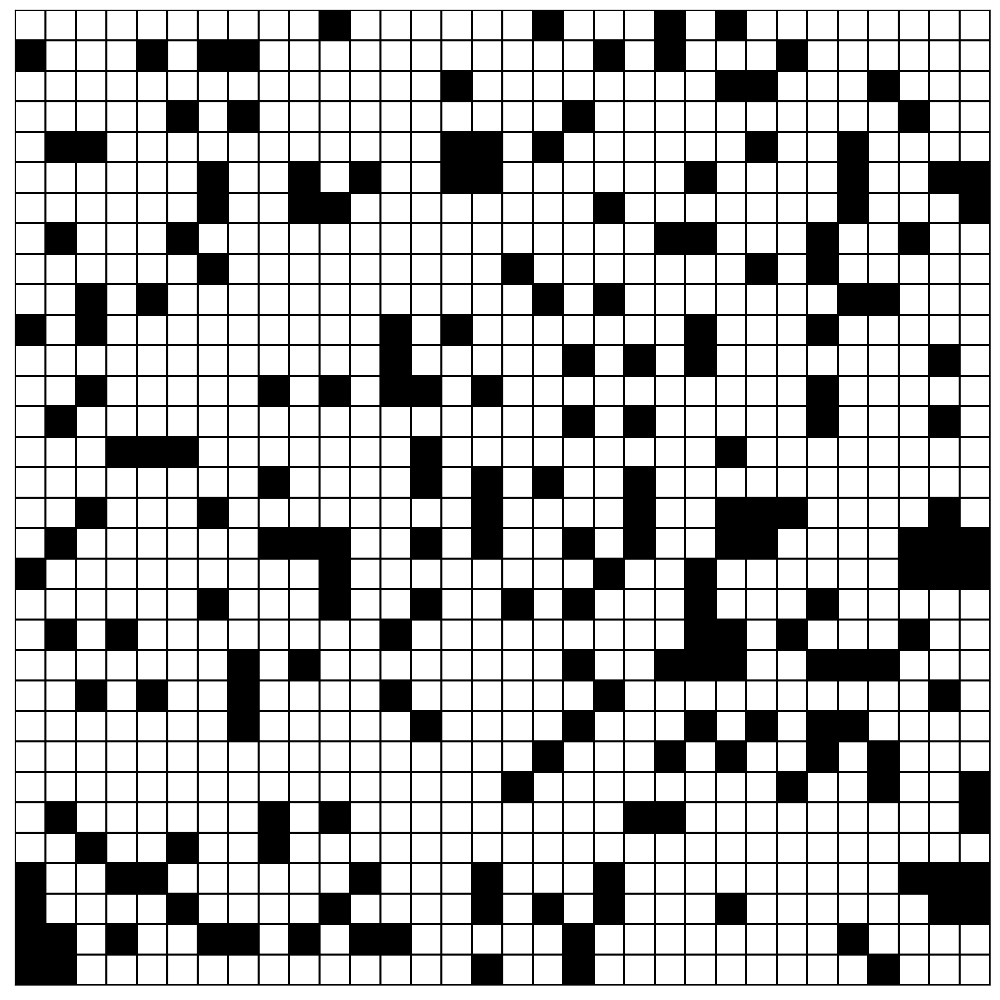
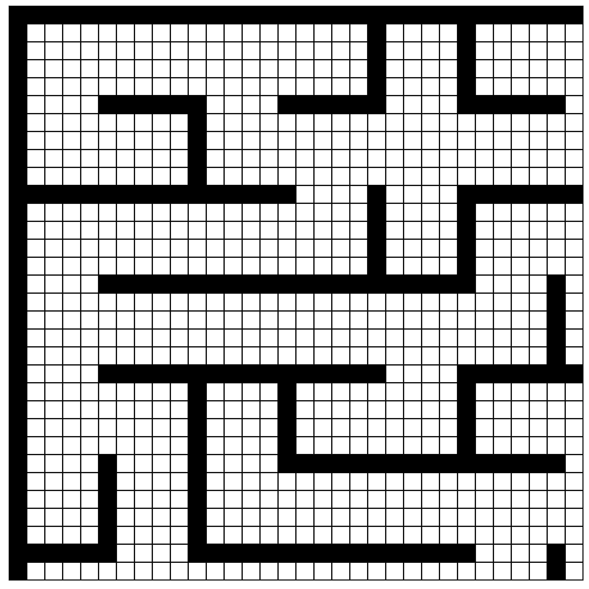
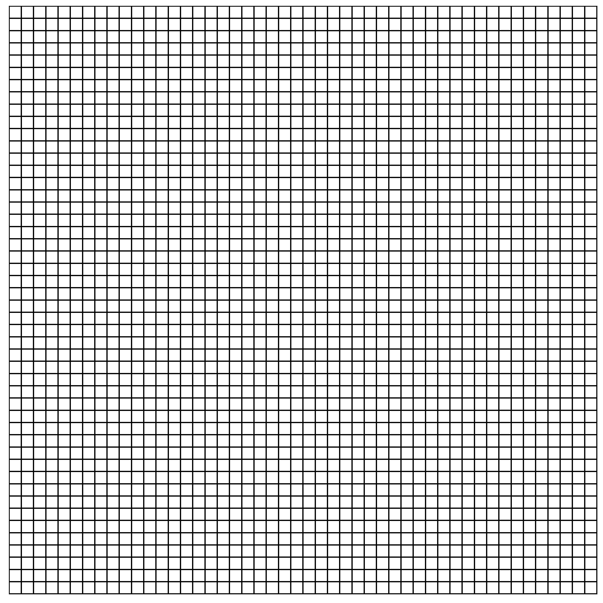
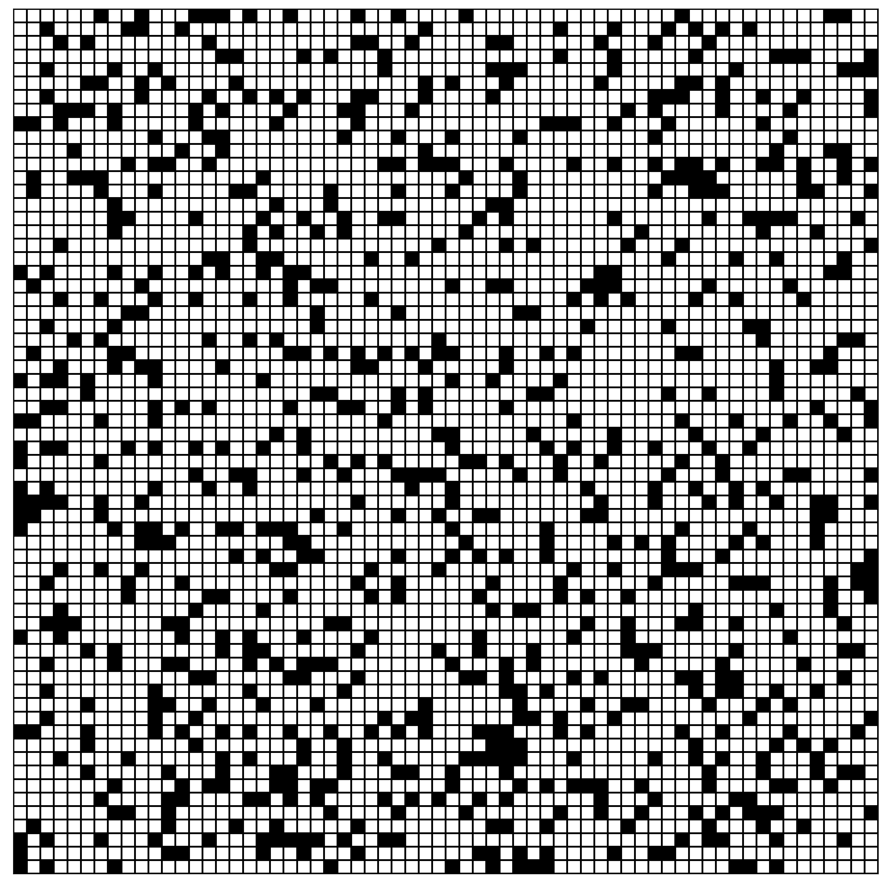
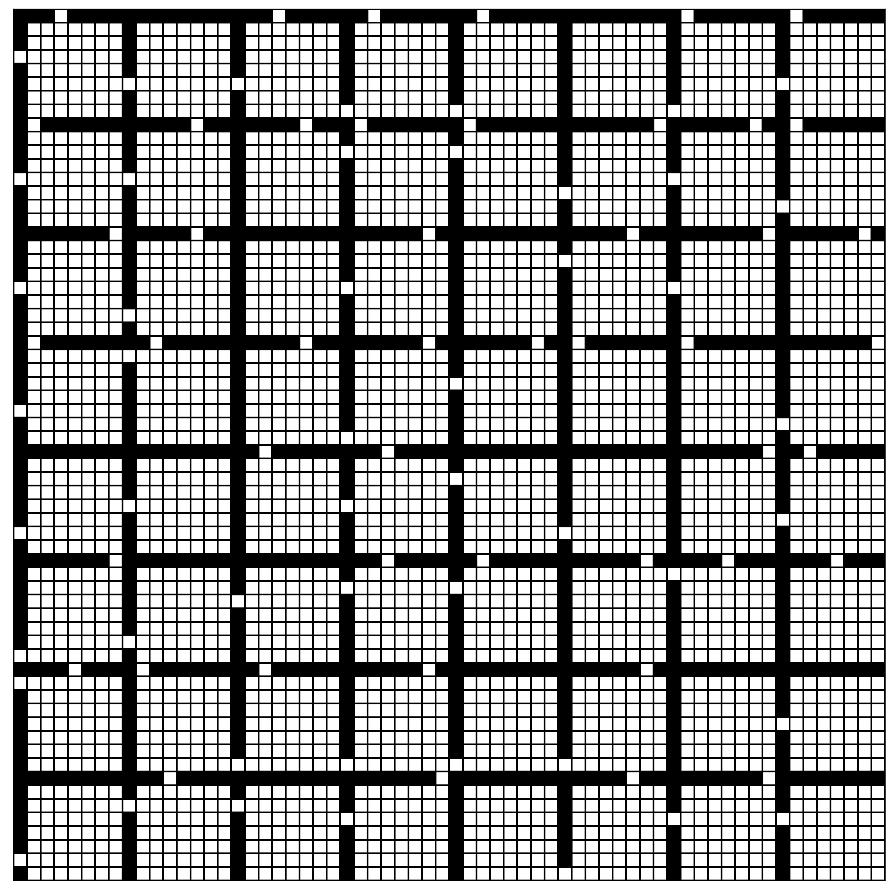
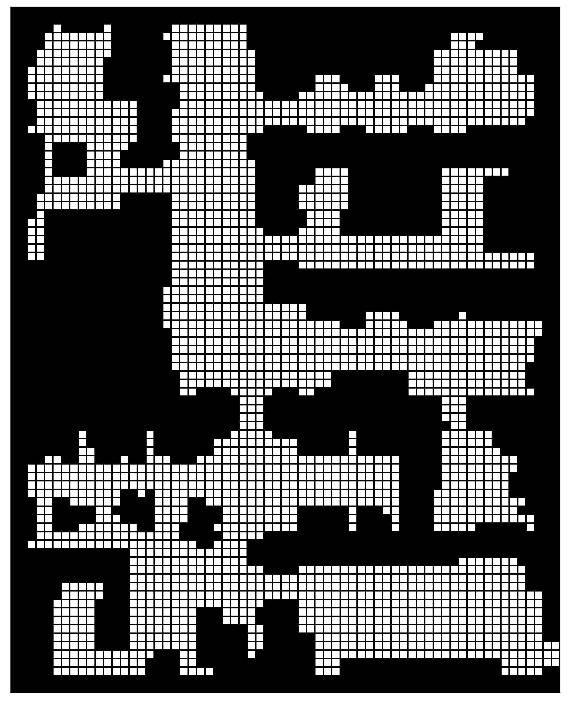
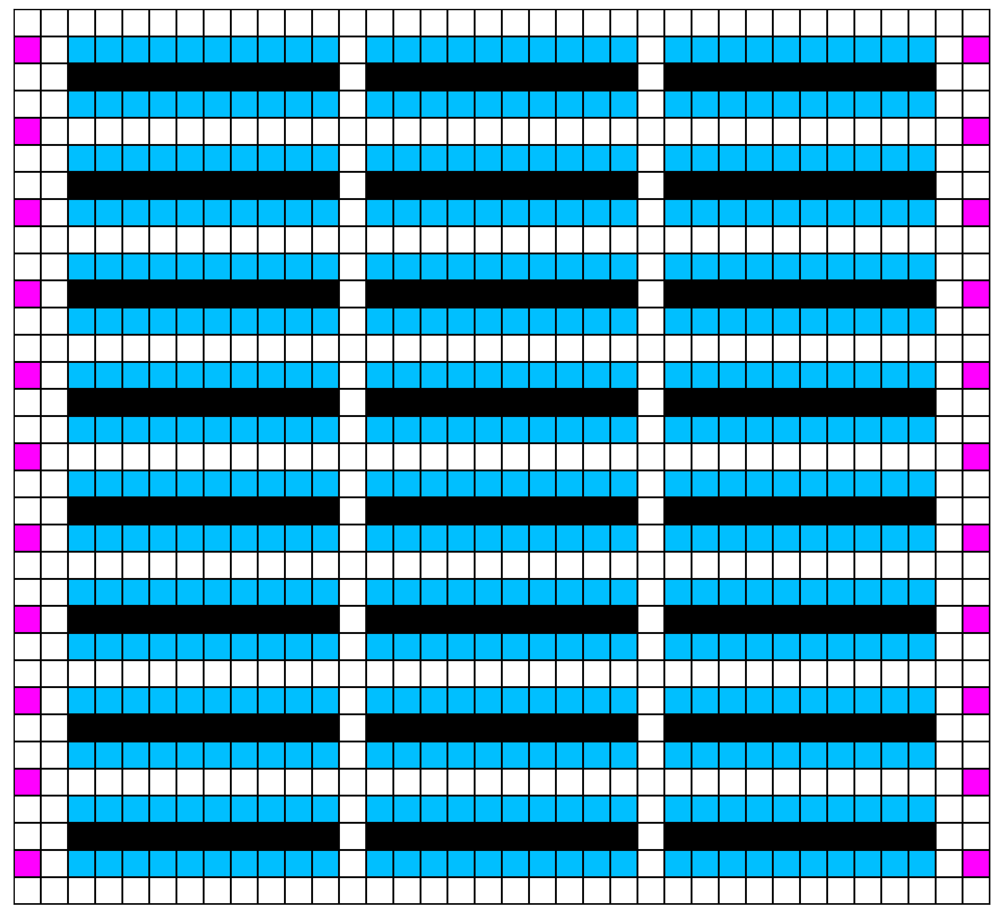
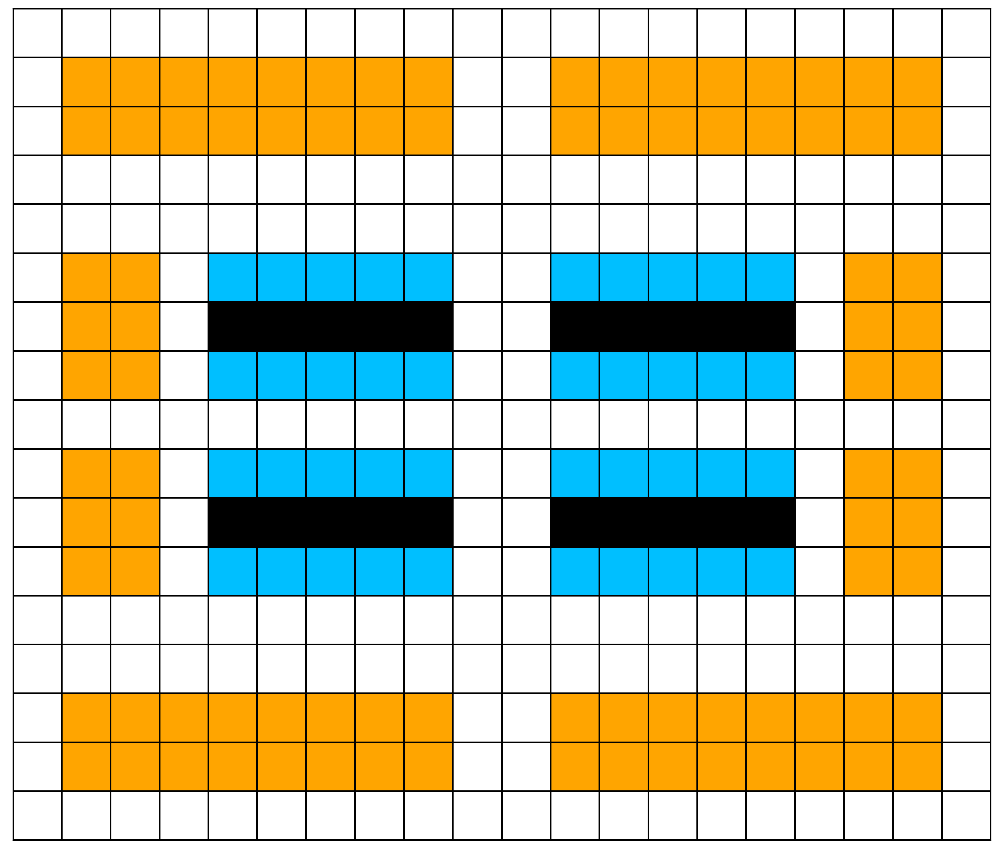

## **Optimized Guidance Graphs**

All optimized guidance graphs are available in the following table for download and analysis. The guidance graphs are offered in `csv` format. Each row of the `csv` file contains information of a vertice with the following entries:

1. `id` : id of the vertice.
2. `type` : type of the vertice. `.` for empty space, `@` for obstacles, `w` for workstations, and `e` for endpoints.
3. `x` : x-coordinate of the vertice in the grid map.
4. `y` : y-coordinate of the vertice in the grid map.
5. `weight_to_RIGHT` : edge weight of the current vertice to the vertice on the right, if valid.
6. `weight_to_UP` : edge weight of the current vertice to the vertice upward, if valid.
7. `weight_to_LEFT` : edge weight of the current vertice to the vertice on the left, if valid.
8. `weight_to_DOWN` : edge weight of the current vertice to the vertice downward, if valid.
9.  `weight_for_WAIT` : wait cost of the current vertice, if valid.

If an edge/vertice is invalid (e.g. the vertice is an obstacle), the corresponding edge weight/wait cost is `inf`.

For more information about the maps, please refer to the original paper or [MAPF benchmark sets](http://mapf.info/index.php/Main/Benchmarks).

<table border="1px" class="no-scroll">
    <tr>
        <td> Map Preview </td>
        <td> Map Name </td>
        <td> Dimension </td>
        <td> #valid vertices, #valid edges </td>
        <td> Guidance Graphs </td>
    </tr>
    <tr>
        <td> </td>
        <td style="vertical-align: middle;"> random-32-32-20 </td>
        <td style="vertical-align: middle;"> 32 $\times$ 32 </td>
        <td style="vertical-align: middle;"> 819, 2540</td>
        <td style="vertical-align: middle;">
            <strong><u><a href="g_graph/pibt_random_cma-es_32x32_400_agents_four-way-move.csv" download> PIBT + CMA-ES</a></u> </strong>
            <strong><u><a href="g_graph/pibt_random_cma-es_piu-transfer_32x32_400_agents_four-way-move.csv" download> PIBT + PIU </a></u></strong>
        </td>
    </tr>
    <tr>
        <td> </td>
        <td style="vertical-align: middle;"> maze-32-32-4 </td>
        <td style="vertical-align: middle;"> 32 $\times$ 32 </td>
        <td style="vertical-align: middle;"> 790, 2694</td>
        <td style="vertical-align: middle;">
            <strong><u><a href="g_graph/pibt_maze-32-32-4_cma-es_400_agents_four-way-move_g_graph.csv" download> PIBT + CMA-ES</a></u> </strong>
            <strong><u><a href="g_graph/pibt_maze-32-32-4_cma-es-piu_400_agents_four-way-move_g_graph.csv" download> PIBT + PIU </a></u></strong>
        </td>
    </tr>
    <tr>
        <td> </td>
        <td style="vertical-align: middle;"> empty-48-48 </td>
        <td style="vertical-align: middle;"> 48 $\times$ 48 </td>
        <td style="vertical-align: middle;"> 2304, 9024</td>
        <td style="vertical-align: middle;">
            <strong><u><a href="g_graph/pibt_empty-48-48_cma-es_1000_agents_four-way-move_g_graph.csv" download> PIBT + CMA-ES</a></u> </strong>
            <strong><u><a href="g_graph/pibt_empty-48-48_cma-es-piu_1000_agents_four-way-move_g_graph.csv" download> PIBT + PIU </a></u></strong>
        </td>
    </tr>
    <tr>
        <td> </td>
        <td style="vertical-align: middle;"> random-64-64-20 </td>
        <td style="vertical-align: middle;"> 64 $\times$ 64 </td>
        <td style="vertical-align: middle;"> 3270, 10298</td>
        <td style="vertical-align: middle;">
            <strong><u><a href="g_graph/pibt_random-64-64-20_cma-es_1500_agents_four-way-move_g_graph.csv" download> PIBT + CMA-ES</a></u> </strong>
            <strong><u><a href="g_graph/pibt_random-64-64-20_cma-es-piu_1500_agents_four-way-move_g_graph.csv" download> PIBT + PIU </a></u></strong>
        </td>
    </tr>
    <tr>
        <td></td>
        <td style="vertical-align: middle;"> room-64-64-8 </td>
        <td style="vertical-align: middle;"> 64 $\times$ 64 </td>
        <td style="vertical-align: middle;"> 3232, 11108 </td>
        <td style="vertical-align: middle;">
            <strong><u><a href="g_graph/pibt_room_cma-es_64x64_1500_agents_four-way-move.csv" download> PIBT + CMA-ES</a></u> </strong>
            <strong><u><a href="g_graph/pibt_room_cma-es-piu-transfer_64x64_1500_agents_four-way-move.json.csv" download> PIBT + PIU </a></u></strong>
        </td>
    </tr>
    <tr>
        <td> </td>
        <td style="vertical-align: middle;"> den312d </td>
        <td style="vertical-align: middle;"> 64 $\times$ 81 </td>
        <td style="vertical-align: middle;"> 2445, 8782</td>
        <td style="vertical-align: middle;">
            <strong><u><a href="g_graph/pibt_den312d_cma-es_1200_agents_four-way-move_g_graph.csv" download> PIBT + CMA-ES</a></u> </strong>
            <strong><u><a href="g_graph/pibt_den312d_cma-es-piu_1200_agents_four-way-move_g_graph.csv" download> PIBT + PIU </a></u></strong>
        </td>
    </tr>
    <tr>
        <td></td>
        <td style="vertical-align: middle;"> warehouse 33 $\times$ 36 </td>
        <td style="vertical-align: middle;"> 33 $\times$ 36 </td>
        <td style="vertical-align: middle;"> 948, 3126 </td>
        <td style="vertical-align: middle;">
            <strong><u><a href="g_graph/pibt_warehouse-33x36_w_mode_cma-es_400_agents_four-way-move.csv" download> PIBT + CMA-ES</a></u> </strong>
            <strong><u><a href="g_graph/pibt_warehouse-33x36_w_mode_cma-es-piu-transfer_400_agents_four-way-move.csv" download> PIBT + PIU </a></u> </strong>
            <strong><u><a href="g_graph/kiva_33x36_human_cma-es_opt_220_agents.csv" download> RHCR + CMA-ES</a></u> </strong>
        </td>
    </tr>
    <tr>
        <td></td>
        <td style="vertical-align: middle;"> warehouse 17 $\times$ 20 </td>
        <td style="vertical-align: middle;"> 17 $\times$ 20 </td>
        <td style="vertical-align: middle;"> 320, 1158 </td>
        <td style="vertical-align: middle;">
            <strong><u><a href="g_graph/kiva_dpp_17x20_human_cma-es_opt_88_agents.csv" download> DPP + CMA-ES</a></u> </strong>
        </td>
    </tr>
</table>